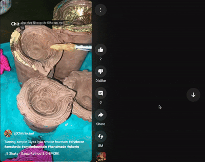
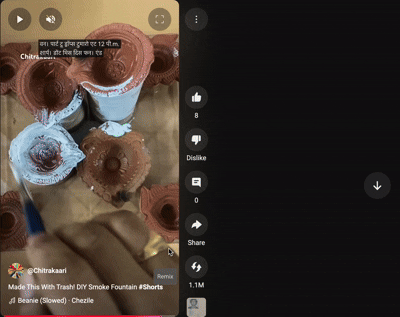
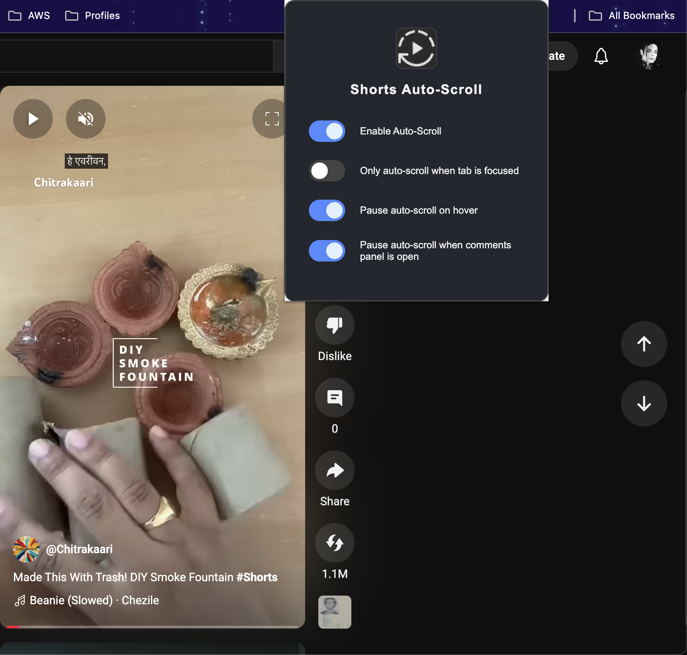
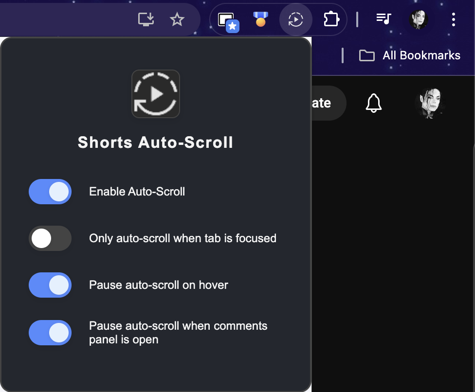

# 🎬 YTShortsFlow

> **Let Shorts Flow, Hands-Free!** ⚡ This Chrome extension automatically scrolls through YouTube Shorts so you can binge-watch without lifting a finger. Perfect for those endless scrolling sessions! 🚀

---

<blockquote style="background:#fffbe6;border-left:6px solid #ffd700;padding:1em 1.5em;margin:1.5em 0;font-size:1.15em;font-weight:bold;color:#b36b00;">
  ⚠️ **IMPORTANT:**  
  AFTER FIRST INSTALLING <b>YTShortsFlow</b>, PLEASE <u>REFRESH</u> YOUR YOUTUBE SHORTS PAGE TO ACTIVATE THE EXTENSION.
</blockquote>

---

## 🎥 Demo

- **Auto-scroll in action (GIF):**
  - 🎬 Auto-scroll paused when the mouse is hovered over the shorts video.
    

  - 🎬 Auto-scroll triggers as soon as the shorts video ends.
    

- **Video demo (alt source):**
  - [Demo 1 (mov)](samples/mov/ytshortsflow-demo-1.mov)
  - [Demo 2 (mov)](samples/mov/ytshortsflow-demo-2.mov)
  - **Credit:** Demo video based on [this YouTube Short](https://www.youtube.com/shorts/GfkL1G0VFgA)

- **Popup UI:**
  
  

- **Auto-scroll Toast:**
  
  

## ✨ What's the Magic?

This extension is like having a personal assistant that knows exactly when you're done watching a Short and automatically moves to the next one. No more manual clicking or awkward pauses! 

### 🎯 Key Features
- **🎬 Smart Auto-Scroll:** Jumps to the next Short when the video ends or progress bar completes
- **💡 Keyboard Shortcuts:** Use right arrow to open comments, left arrow to close comments
- **⏲️ Customizable Toast Duration:** Toast notifications now auto-hide after a set time (default 2s)
- **🎪 Fun Toast Notifications:** Get a little celebration when it jumps to the next video
- **⏸️ Smart Pause Options:** 
  - Pause on hover (optional)
  - Pause when comments panel is open (optional)
  - Pause when tab is not focused (optional)
- **🎨 Beautiful UI:** Clean Material Design popup with customizable settings
- **🔄 One-Click Control:** Enable/disable with a simple switch
- **⚙️ Customizable:** Choose which pause features you want enabled

## 🚀 Quick Start

### Installation (Super Easy!)
1. **📥** Download or clone this repository
2. **🔧** Open Chrome and navigate to `chrome://extensions`
3. **⚙️** Enable "Developer mode" (toggle in top right)
4. **📦** Click "Load unpacked" and select this folder
5. **📌** Pin the extension to your toolbar for easy access

### How to Use
1. **🎬** Open any YouTube Short (`youtube.com/shorts/...`)
2. **🎯** Watch your Short - the extension will automatically scroll to the next one when it ends
3. **⚙️** Click the autoplay icon in your toolbar to access settings
4. **🎪** Enjoy the seamless scrolling experience!

## 🎛️ Configuration Options

| Setting | What it does |
|---------|-------------|
| **Enable Auto-Scroll** | Master switch to turn the magic on/off |
| **Only auto-scroll when tab is focused** | Prevents accidental skips when you're not watching |
| **Pause auto-scroll on hover** | Pauses when you hover over the video or toast |
| **Pause auto-scroll when comments panel is open** | Pauses when the comments panel is expanded |

## 🎪 Pro Tips

- **Customizable Pause:** Choose which pause features work best for your browsing style
- **Hover Control:** Enable hover pause if you like to read comments or take breaks
- **Comments Control:** Enable comments pause if you want to read without interruption
- **Tab Focus:** Enable tab focus to prevent skips when you're multitasking
- **Toast Messages:** Keep an eye on those fun toast notifications for status updates!

## 🛠️ Technical Details

- **Manifest V3** compliant
- **Material Design** UI components
- **Chrome Storage API** for settings persistence
- **MutationObserver** for reliable DOM detection
- **Toast notifications** with adaptive dark/light mode

## 📄 License

This project is licensed under the Creative Commons Attribution-NonCommercial 4.0 International License (CC BY-NC 4.0). See LICENSE for details.

---

**Made with ❤️ for the YouTube Shorts community!** 

*Icon: Material Design Autoplay Icon* 