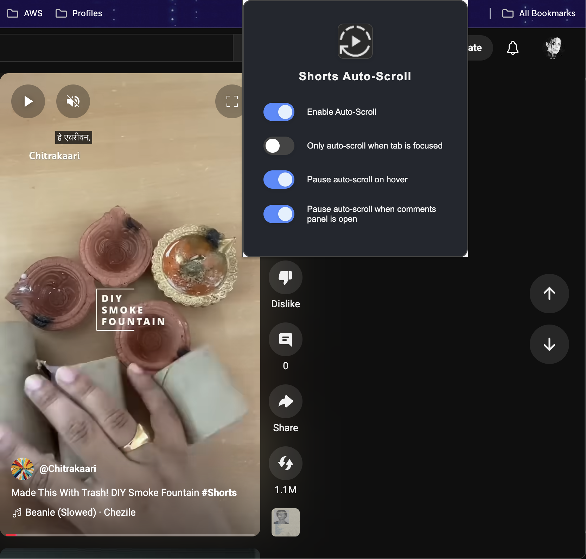
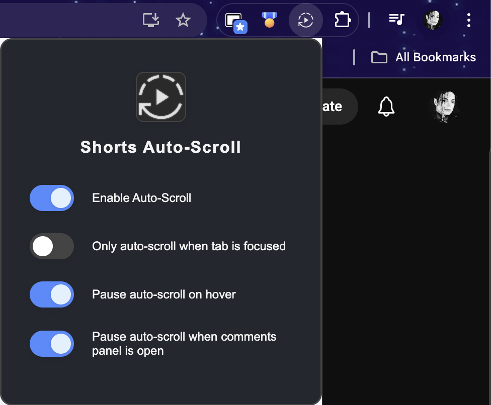
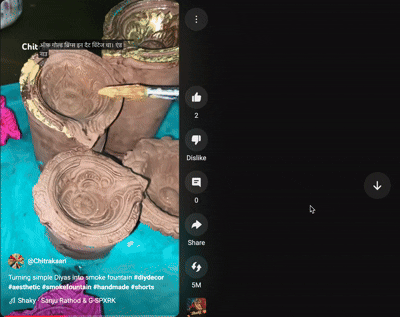

# Chrome Web Store Listing

## Extension Name
YTShortsFlow

## Short Description
Effortless, hands-free YouTube Shorts scrolling with YTShortsFlow!

## Detailed Description
🎬 **Never Stop Scrolling!** 

Transform your YouTube Shorts experience with this intelligent auto-scroller that automatically moves to the next Short when the current one ends. Perfect for binge-watching sessions!

**✨ Key Features:**
• **Smart Auto-Scroll** - Automatically jumps to the next Short when video ends
• **Pause on Hover** - Hover over the video to pause auto-scroll
• **Tab Focus Aware** - Only auto-scrolls when you're actually watching
• **Comments Friendly** - Pauses when comments panel is open
• **Beautiful UI** - Clean Material Design popup with easy controls
• **Toast Notifications** - Fun feedback when jumping between Shorts

**🎯 Perfect For:**
• Endless YouTube Shorts browsing
• Background watching while multitasking
• Discovering new content seamlessly
• Hands-free Shorts consumption

**⚡ How It Works:**
1. Install the extension
2. Open any YouTube Short
3. Watch and enjoy - it automatically scrolls to the next one!
4. Use the popup to customize settings

**🔧 Smart Features:**
• Detects when videos end or progress bar completes
• Pauses on hover for reading comments
• Only works when tab is focused (optional)
• Settings persist across browser sessions
• Works with YouTube's dynamic interface

**🎨 Beautiful Design:**
• Material Design UI components
• Glassy, modern interface
• Responsive design
• Dark/light mode adaptive

**🛡️ Privacy & Security:**
• No data collection
• Only works on YouTube Shorts pages
• Open source and transparent
• Manifest V3 compliant

**🚀 Ready to enhance your YouTube Shorts experience? Install now and never manually scroll again!**

## Category
Productivity

## Language
English

## Screenshots
- Popup UI: 
- Auto-scroll Toast: 
- Demo 1 (GIF): 
- Demo 2 (GIF): 
- Demo 1 (mov): [ytshortsflow-demo-1.mov](samples/mov/ytshortsflow-demo-1.mov)
- Demo 2 (mov): [ytshortsflow-demo-2.mov](samples/mov/ytshortsflow-demo-2.mov)
- **Credit:** Demo video based on [this YouTube Short](https://www.youtube.com/shorts/GfkL1G0VFgA)

## Promotional Images
- Use the above screenshots, GIFs, and demo videos for Chrome Web Store promotional images.

## Privacy Policy
This extension does not collect, store, or transmit any personal data. It only interacts with YouTube Shorts pages to provide auto-scrolling functionality.

## Support
For support, feature requests, or bug reports, please visit our GitHub repository or contact us through the Chrome Web Store.

## Keywords
youtube shorts, auto scroll, auto play, video player, youtube extension, shorts browser, video automation, youtube tools, productivity, video streaming 